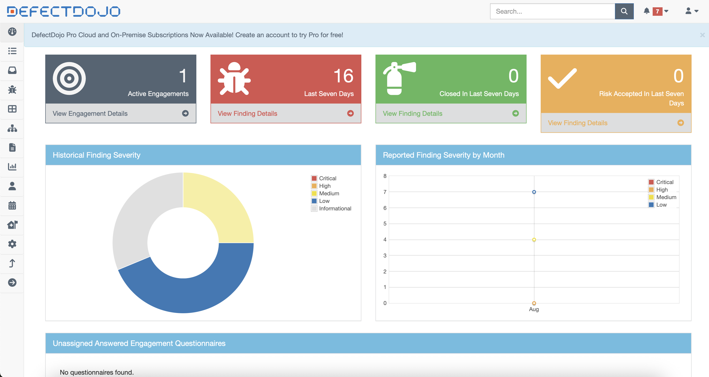
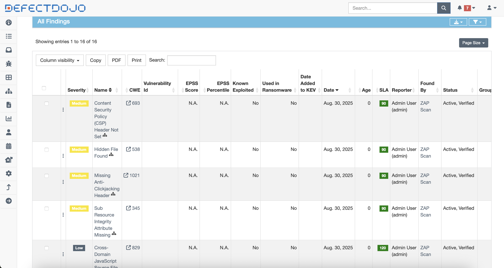

# Vulnerability Reporting & Tracking System

## Overview

This document outlines the implementation and operation of our vulnerability reporting and tracking system using DefectDojo for comprehensive vulnerability lifecycle management.

---

## System Architecture

### DefectDojo Integration

This is done via this python script [upload_to_defectdojo.py](../upload_to_defectdojo.py)

### Key Components
1. **Vulnerability Discovery**: Automated and manual security testing
2. **Data Ingestion**: DefectDojo API integration with scanning tools 
3. **Risk Assessment**: CVSS scoring and business impact analysis
4. **Tracking & Monitoring**: Real-time dashboards and reporting
5. **Remediation Management**: Assignment, tracking, and verification

---

## DefectDojo Dashboard Overview

### Main Dashboard

*Figure 3: DefectDojo main dashboard providing executive-level overview of vulnerability management metrics, including severity distribution and remediation progress.*

### Dashboard Features
- **Real-time Vulnerability Metrics**: Live counts by severity
- **Trend Analysis**: Historical vulnerability discovery and closure rates
- **SLA Tracking**: Remediation timeline compliance monitoring
- **Team Performance**: Individual and team productivity metrics

---

## Reporting Capabilities

### Executive Reports

*Figure 4: Executive dashboard showing high-level security metrics, trend analysis, and KPI tracking for leadership visibility.*

### Technical Reports

📊 [Sample Vulnerability Metrics Report (PDF)](./assets/vulnerability-report-admin-dev-beaconconnect.pdf)

*Comprehensive technical report including detailed vulnerability analysis, remediation timelines, and team performance metrics.*

### Custom Reports Available
- **Vulnerability Status by Product**
- **Compliance Audit Reports**
- **Risk Assessment Summaries**
- **Trend Analysis Reports**
